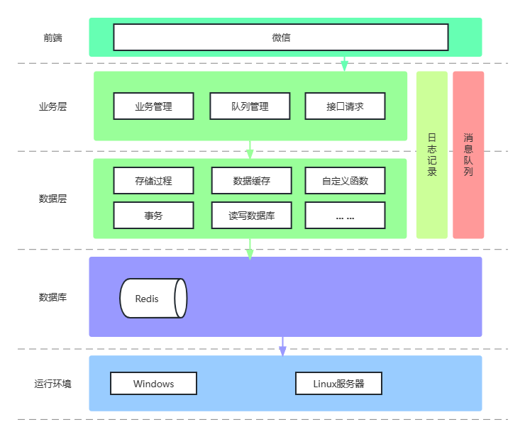

## 流程图
 

## 架构图
 

## 功能模块
    - 1.提供针对性的知识库搜索和答案推荐服务。
    - 2.支持自然语言处理（NLP）技术，理解用户提出的问题。
    - 3.能够获取多种数据源，包括数据库、网络、文本等，以支持复杂的问答模型。
    - 4.支持多语言和多平台，包括网页、移动应用、微信公众号等。
    - 5.提供数据可视化分析工具，帮助用户更好地理解数据并提高系统的决策能力。
    - 6.支持智能对话功能，可以根据用户输入的问题和上下文，实现自动生成回复。
    - 7.提供数据自动抽取和关系提取功能，从数据中自动化提取实体和关系，丰富知识库内容。
    - 8.提供自动学习和加强学习功能，从用户反馈中不断优化和改进系统的性能。
    - 9.提供数据安全和隐私保护功能，确保用户数据的安全和隐私不被泄露。
    - 10.提供系统监控和故障诊断功能，及时发现并处理问题，保证系统的稳定性。

## 组成部分
智能问答系统的基本架构通常由以下几个部分组成： 

1. 用户接口：用于收集用户输入的问题或查询请求，通常是通过网页或APP的形式提供。 

2. 自然语言处理（NLP）：用于分析用户输入的信息，提取关键词和实体，以便于进行后续的知识库检索或答案生成。 

3. 知识库：用于存储各种领域的知识和信息，通常以图谱、本体等方式组织，并包括基础数据、业务数据和用户数据等。 

4. 答案生成：根据用户输入和知识库中的信息，生成针对性的答案，并对答案进行优化和排序等操作，以提高系统的准确性和可信度。 

5. 反馈机制：用于收集用户的反馈信息，包括答案是否满意、用户意图是否被正确理解等，从而不断优化和改进智能问答系统的性能。 
