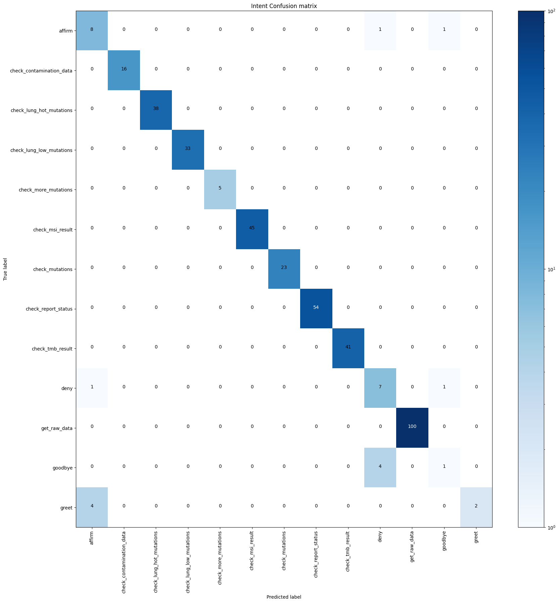
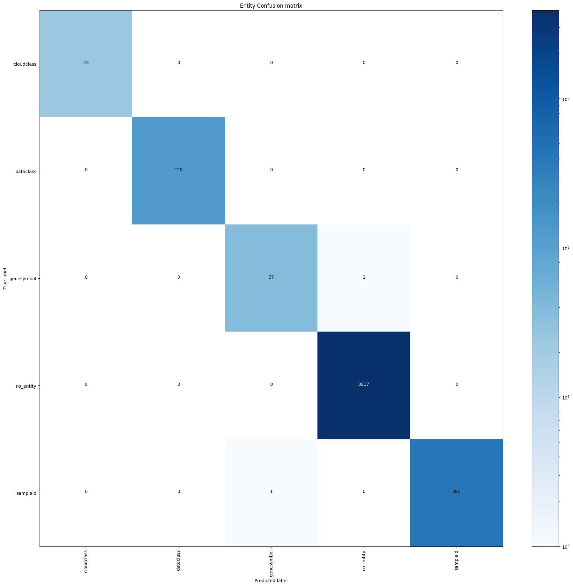

## 测试和预发布
包括测试内容和版本信息

### 单元测试
测试每个意图的识别结果，确保不冲突、不遗漏
`rasa test core`


### 集成测试

项目结构主要包括微信接收发送端和服务器端，不同组件之间通过mq交互

确保消息在发送过程中不重复、不丢失

### 系统测试

交叉验证结果
`rasa test nlu -u data/nlu.md --config config.yml --cross-validation`
```bash
2023-03-21 11:47:49 INFO     rasa.model_testing  - CV evaluation (n=5)
2023-03-21 11:47:49 INFO     rasa.model_testing  - Intent evaluation results
2023-03-21 11:47:49 INFO     rasa.nlu.test  - train Accuracy: 1.000 (0.000)
2023-03-21 11:47:49 INFO     rasa.nlu.test  - train F1-score: 1.000 (0.000)
2023-03-21 11:47:49 INFO     rasa.nlu.test  - train Precision: 1.000 (0.000)
2023-03-21 11:47:49 INFO     rasa.nlu.test  - test Accuracy: 0.969 (0.006)
2023-03-21 11:47:49 INFO     rasa.nlu.test  - test F1-score: 0.963 (0.009)
2023-03-21 11:47:49 INFO     rasa.nlu.test  - test Precision: 0.962 (0.012)
2023-03-21 11:47:49 INFO     rasa.model_testing  - Entity evaluation results
2023-03-21 11:47:49 INFO     rasa.nlu.test  - Entity extractor: DIETClassifier
2023-03-21 11:47:49 INFO     rasa.nlu.test  - train Accuracy: 1.000 (0.000)
2023-03-21 11:47:49 INFO     rasa.nlu.test  - train F1-score: 1.000 (0.000)
2023-03-21 11:47:49 INFO     rasa.nlu.test  - train Precision: 1.000 (0.000)
2023-03-21 11:47:49 INFO     rasa.nlu.test  - Entity extractor: DIETClassifier
2023-03-21 11:47:49 INFO     rasa.nlu.test  - test Accuracy: 1.000 (0.001)
2023-03-21 11:47:49 INFO     rasa.nlu.test  - test F1-score: 0.998 (0.005)
2023-03-21 11:47:49 INFO     rasa.nlu.test  - test Precision: 0.998 (0.003)
```
意图混淆矩阵



实体混淆矩阵



根据给出的数据，可以得出以下结论： 
 
1. Confusion Matrix: 这部分数据展示了对话系统在意图（intent）和实体（entity）分类方面的混淆矩阵。可以看出对于大多数类别，对话系统都有很好的分类能力，但是也存在一些错分的情况。 
 
2. Evaluation for Entity Extractor：这部分展示了实体提取器（DIETClassifier）的评估结果。可以看出在训练集和测试集上，该实体提取器的精度、F1值均为1，非常准确。 
 
3. CV evaluation：这部分数据展示了对话系统在意图分类和实体提取方面的CV（Cross Validation，交叉验证）评估结果。可以看出在训练集和测试集上，对话系统的意图分类和实体提取性能均较好，但是在测试集上相比于训练集有一定的下降。 
 
综上所述，对话系统在意图分类和实体提取方面表现较好，但还存在一些待解决的错误分类问题。针对错误分类问题，需要对数据进行进一步分析，优化算法和模型。


### 预发布环境

- Python 3.8.10
- Rasa 3.0.x
- Redis版本: 7.0.5
- Rabbitmq 3.8.14

```bash
微信接收发送端
- 前台运行
rasa系统
- 通过dockerfile构建docker镜像 liujie/nightwatchman:v1
rabbitmq
- 消息持久化
```

<!-- 
如果您在开发一个软件系统或者一个网站等，那么在将其正式发布到生产环境之前，您可能需要进行一些测试和预发布。下面是一些您应该考虑的内容：
1. 单元测试：编写单元测试用例，对每个组件或者模块进行测试，可以检查代码是否满足其预期的功能和结果。
2. 集成测试：测试不同的组件或者模块之间的交互和整合，以确保它们可以正确地协作。
3. 系统测试：测试整个系统的功能、性能、安全性、易用性等方面，以确保它符合预期的标准。
4. 用户验收测试：由最终用户或者受托人执行的测试，以确保系统符合其期望的功能和结果。
5. 预发布环境：在与生产环境相似的环境中进行测试，以确保系统在真实环境中的表现。
6. 回归测试：在对系统进行更改后重新运行之前的测试，以确保更改不会影响系统的功能和结果。
7. 性能测试：测试系统在负载高峰期的性能，以确保它可以在不降低性能的情况下处理大的负载。
8. 安全测试：测试系统的安全性，以确保它能够抵御各种安全威胁和攻击。
9.  备份和恢复测试：测试系统备份和恢复的过程，以确保在系统故障或者数据丢失的情况下可以快速恢复。

您可以根据您的具体需求和情况选择其中的几项进行测试和预发布，以确保系统的质量和稳定性。


这些是测试和预发布的常见项，您可以按照以下格式进行编写：
 1. 单元测试：
    描述：在此处简要描述单元测试的目的和作用。
    步骤：在此处描述单元测试的具体步骤，包括如何编写测试用例、如何运行测试等。
    结果：在此处描述测试的结果，并确认代码是否符合预期的功能和结果。
 2. 集成测试：
    描述：在此处简要描述集成测试的目的和作用。
    步骤：在此处描述集成测试的具体步骤，包括如何测试不同组件或模块之间的交互和整合等。
    结果：在此处描述测试的结果，并确认各组件或模块能够正确协作。
 3. 系统测试：
    描述：在此处简要描述系统测试的目的和作用。
    步骤：在此处描述系统测试的具体步骤，包括如何测试系统的功能、性能、安全性、易用性等方面。
    结果：在此处描述测试的结果，并确认系统是否符合预期的标准。
 4. 用户验收测试：
    描述：在此处简要描述用户验收测试的目的和作用。
    步骤：在此处描述用户验收测试的具体步骤，包括如何进行测试、如何记录测试结果等。
    结果：在此处描述测试的结果，并确认系统是否符合最终用户或受托人的期望。
 5. 预发布环境：
    描述：在此处简要描述预发布环境测试的目的和作用。
    步骤：在此处描述预发布环境测试的具体步骤，包括如何在与生产环境相似的环境中进行测试等。
    结果：在此处描述测试的结果，并确认系统在真实环境中的表现。
 6. 回归测试：
    描述：在此处简要描述回归测试的目的和作用。
    步骤：在此处描述回归测试的具体步骤，包括如何重新运行之前的测试等。
    结果：在此处描述测试的结果，并确认更改不会影响系统的功能和结果。
 7. 性能测试：
    描述：在此处简要描述性能测试的目的和作用。
    步骤：在此处描述性能测试的具体步骤，包括如何测试系统在负载高峰期的性能等。
    结果：在此处描述测试的结果，并确认系统能够在不降低性能的情况下处理大的负载。
 8. 安全测试：
    描述：在此处简要描述安全测试的目的和作用。
    步骤：在此处描述安全测试的具体步骤，包括如何测试系统的安全性等。
    结果：在此处描述测试的结果，并确认系统能够抵御各种安全威胁和攻击。
 9. 备份和恢复测试：
    描述：在此处简要描述备份和恢复测试的目的和作用。
    步骤：在此处描述备份和恢复测试的具体步骤，包括如何测试系统备份和恢复的过程等。
    结果：在此处描述测试的结果，并确认系统在出现故障或数据丢失情况下可以快速恢复。 -->
